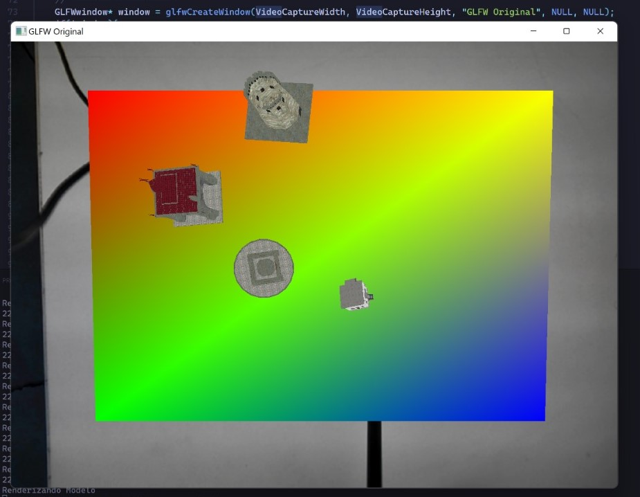
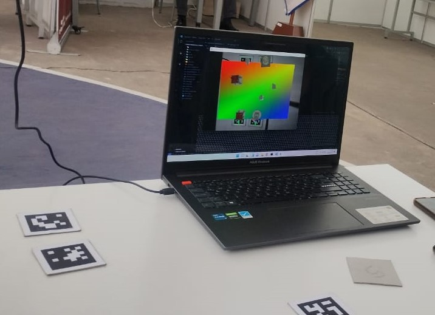

# Realidad Aumentada con Marcadores ArUco para la Creación y Manipulación de Maquetas de Ciudades

Este proyecto fusiona la visión por computadora y gráficos 3D para ofrecer una experiencia de realidad aumentada en la creación y manipulación de maquetas de ciudades.

<p float="center">


</p>

## Funcionalidades

- **Visualización de modelos:** La exploración de una variedad de modelos tridimensionales que componen la maqueta de la ciudad, desde edificios hasta iglesias, representa la funcionalidad principal.

- **Establecer plano:** La delimitación de la zona de trabajo se logra posicionando marcadores ArUco en las esquinas deseadas, actuando como puntos de referencia fundamentales.

- **Interacción con marcadores:** El usuario puede interactuar con modelos virtuales mediante dos marcadores ArUco, que sirven como interfaz de usuario tangible para ejecutar acciones específicas.

- **Manipulación de los modelos virtuales:** Empleando marcadores ArUco designados, el usuario puede realizar acciones interactivas como mover, duplicar y eliminar modelos en la maqueta de la ciudad.

## Tecnologías Utilizadas

- **OpenGL:** Para crear y renderizar modelos tridimensionales en tiempo real.

- **OpenCV:** Para realizar tareas como detección de marcadores visuales, calibración de cámaras y procesamiento de imágenes en tiempo real.

- **Aruco:** Para la detección y seguimiento en tiempo real de los marcadores ArUco.

- **ChAruco:** Para mejorar la precisión y estabilidad de la detección de marcadores.

## Implementación

### Visión por Computadora

#### Generación de marcadores

Se generan marcadores ArUco como códigos bidimensionales que actúan como puntos de referencia para ubicar modelos virtuales con precisión.

#### Detección y seguimiento de marcadores

Se utiliza OpenCV y ArUco para detectar y seguir marcadores en tiempo real, involucrando la detección de candidatos y la verificación de la codificación interna de los marcadores.

#### Estimación de poses

La estimación de poses se logra con la función `solvePnP` de OpenCV, proporcionando matrices de rotación y traslación para posicionar objetos virtuales.

#### Calibración de la cámara

Se utiliza CharUco para calibrar la cámara, determinando parámetros intrínsecos y extrínsecos y mejorando la precisión de la detección de marcadores.

### Parte Gráfica

#### Creación de la escena virtual

OpenGL y GLFW se utilizan para configurar un espacio 3D, superponiendo un plano virtual en los marcadores ArUco para posicionar y renderizar modelos tridimensionales.

#### Carga de modelos

Assimp se emplea para cargar modelos tridimensionales, extrayendo información clave como vértices e índices para la renderización.

#### Renderizado de modelos 3D

Se aplican transformaciones basadas en la posición y orientación de los marcadores ArUco para renderizar modelos tridimensionales de manera precisa.

#### Implementación de la interacción

Se crea una interfaz visual para la interacción del usuario, permitiendo la selección y manipulación de modelos virtuales mediante marcadores ArUco.

### Actualización en Tiempo Real

La aplicación se actualiza continuamente para reflejar cambios en la posición y orientación de los marcadores y modelos tridimensionales, proporcionando una experiencia dinámica de realidad aumentada.

## Ejecutar proyecto

### Create marker

int create_marker (int markerId, std::string outfile = "marker.png", int markerSize = 200, int borderBits = 1)

```
create_marker(ID,"markerID.png");
```

## Notas

* Cambiar path de modelos en  ```\augmented_mockup.hpp```
* [Calibrar camara](https://github.com/opencv/opencv_contrib/blob/4.x/modules/aruco/samples/calibrate_camera_charuco.cpp)

## Resources
Models by: Marc-Mons in [turbosquid](https://www.turbosquid.com/es/Search/Artists/Marc-Mons)
